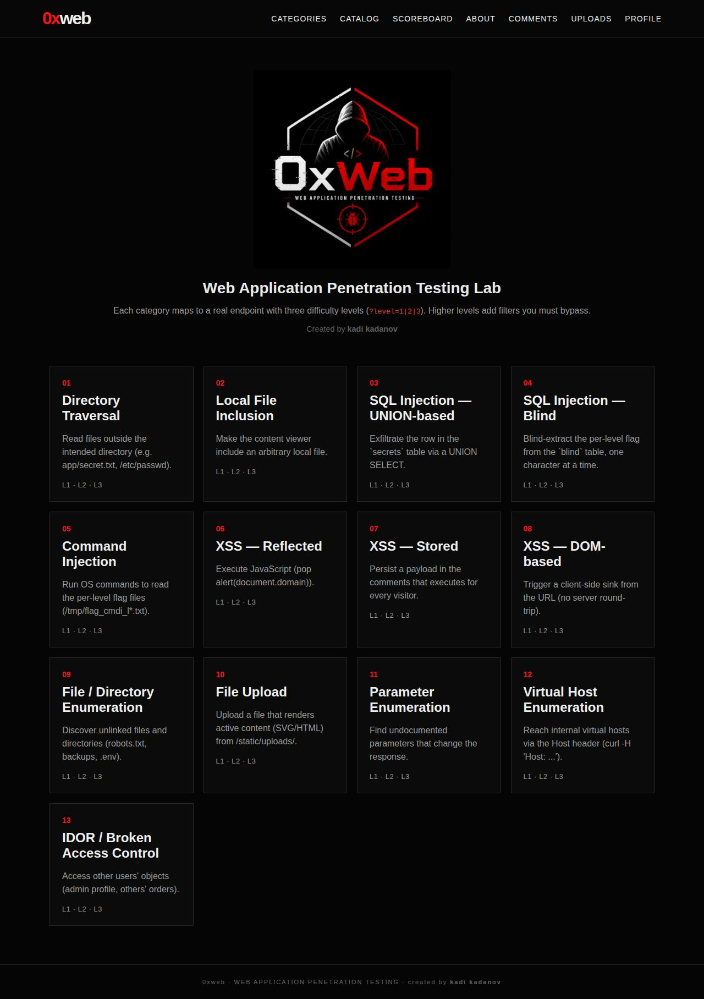
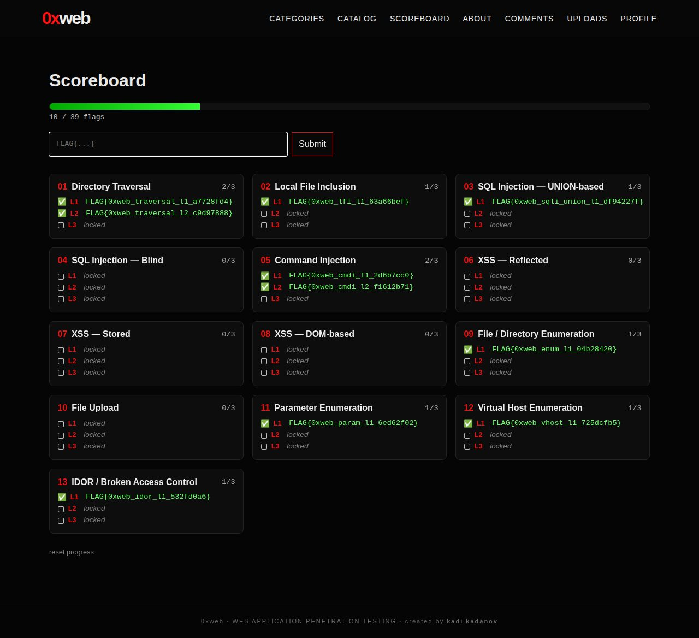
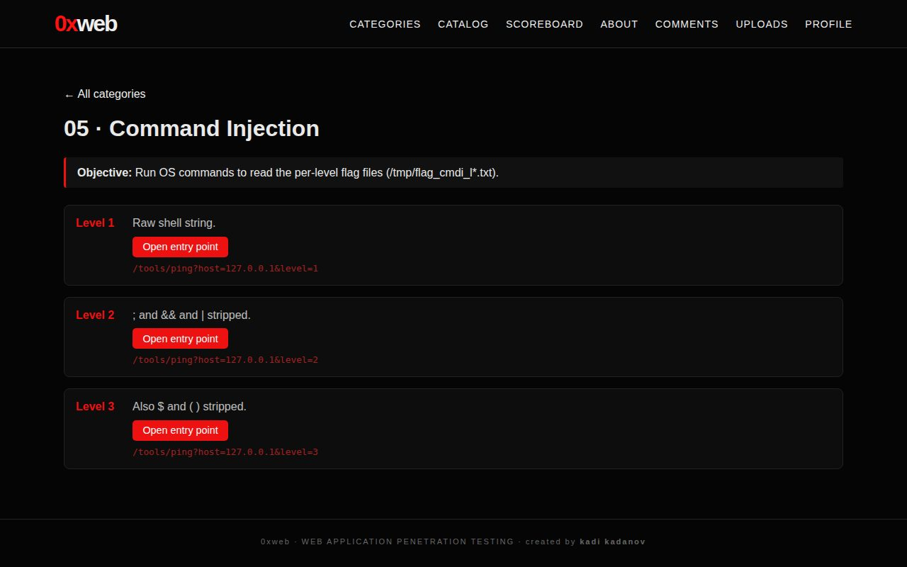
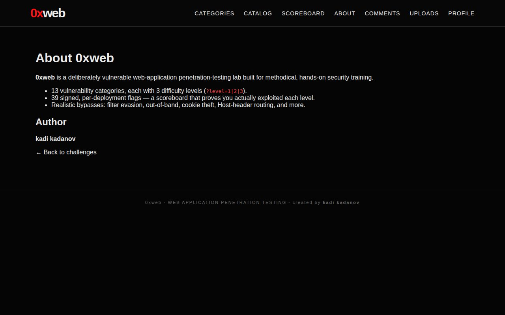

# 0xWeb — Web Application Penetration Testing Lab

> A deliberately vulnerable, local-only training lab for hands-on web application
> security practice. Every challenge maps to a **real endpoint** with **three
> difficulty levels** — higher levels add filters and mitigations you must bypass.

**Author:** kadi kadanov · **License:** MIT

---

## 📸 Screenshots

| Home — challenge catalog | Scoreboard — per-level progress |
|---|---|
|  |  |

| A challenge (levels) | About |
|---|---|
|  |  |

## ✨ Features

- **13 vulnerability categories**, each with **3 difficulty levels** (`?level=1|2|3`).
- **39 signed flags** — each `(category, level)` has its own unguessable flag
  (`FLAG{0xweb_<cat>_l<level>_<hmac>}`), so the scoreboard proves you *actually*
  exploited each level instead of guessing a pattern.
- **Built-in scoreboard** (`/submit`) with per-level progress tracking.
- **Realistic bypasses**: filter evasion, absolute-path & `....//` traversal,
  mixed-case / inline-comment SQLi, `$()` and newline command injection,
  event-handler & attribute-context XSS, content-sniff upload bypass,
  Host-header virtual-host routing, base64 object references, and more.
- Single-file FastAPI app, no external services — runs in one `docker compose` command.

## 🧩 Challenge categories

| # | Category | Sub-types / focus |
|---|----------|-------------------|
| 1 | Directory Traversal | plain · absolute-path · `....//` |
| 2 | Local File Inclusion (LFI) | fall-through · absolute · strip bypass |
| 3 | SQL Injection — UNION-based | numeric · keyword filter · whitespace filter |
| 4 | SQL Injection — Blind | boolean · keyword-filtered · time-based |
| 5 | Command Injection | raw · `$()` · newline |
| 6 | XSS — Reflected | raw · `<script>` strip · attribute context |
| 7 | XSS — Stored | `|safe` · strip · attribute context |
| 8 | XSS — DOM-based | `innerHTML` · filtered · `href`/`javascript:` |
| 9 | File / Directory Enumeration | robots.txt · backups/dotfiles · 403 vs 404 |
| 10 | File Upload | unrestricted · extension blacklist · content sniff |
| 11 | Parameter Enumeration | hidden params & privilege params |
| 12 | Virtual Host Enumeration | Host-header routing |
| 13 | IDOR / Broken Access Control | sequential ids · orders · base64 refs |

## 🚀 Quick start

```bash
git clone <your-repo-url> 0xweb
cd 0xweb
mkdir -p data
docker compose up --build
```

Open **http://127.0.0.1:8000** and start with any challenge card.
Submit flags and track progress at **/submit**.

Stop / reset:

```bash
docker compose down                 # stop (keeps the DB volume)
docker compose down -v && docker compose up --build   # reset DB (named volume)
```

### Run without Docker

```bash
python3 -m venv .venv
.venv/bin/pip install -r requirements.txt
.venv/bin/uvicorn app.main:app --reload --port 8000
```

> Virtual-host challenges use the `Host` header (no `/etc/hosts` edit needed):
> `curl -s http://127.0.0.1:8000/ -H "Host: admin.0xweb.local"`

## 🛠️ Recommended tooling

`nmap` · `whatweb` · `ffuf` · `gobuster` · `wfuzz` · `arjun` · `sqlmap` ·
`dalfox` · `interactsh-client` · Burp Suite. Ready-to-run commands for each
category are in **[TOOLS.md](TOOLS.md)**.

## 🏁 Flags & scoreboard

Flags are `FLAG{0xweb_<category>_l<level>_<hmac8>}`. The 8-hex suffix is derived
per deployment (`data/flag_secret.txt`), so it **cannot be guessed** — you must
extract each flag from the app. XSS challenges award their flag by **cookie theft**
(a non-HttpOnly cookie you steal via `document.cookie`).

An answer key with per-level payloads lives in **SOLUTIONS.md** — *full spoilers*.
Remove it before sharing the repo if you want others to solve it blind.

## ⚠️ Disclaimer

This project is **intentionally vulnerable** and is for **education and authorized
testing only**. Keep it bound to `localhost` (the compose file binds
`127.0.0.1:8000`) and never expose it to a network you do not control. The author
is not responsible for any misuse.

## 📄 License

MIT © kadi kadanov — see [LICENSE](LICENSE).
